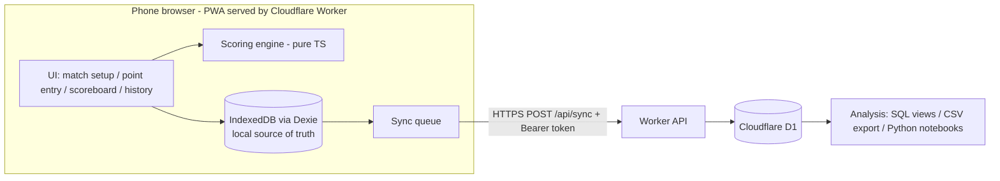

# Sheen Tennis Tracker - Workflow Log

> Read this file at the start of every session to resume from the latest checkpoint.
> Update it after each meaningful step (ideas, decisions, completed work, next actions).

## Project Overview

- **Name:** sheen_tennis_tracker
- **Goal:** Mobile web app (PWA, no native iOS/Android) to record live tennis matches point by point, with point details (serve 1st/2nd, rally, outcome, etc.), automatic scoring under configurable match rules, and cloud storage for later analysis.
- **Hosting (dev):** Cloudflare Worker with static assets (https://sheen-tennis-tracker.sheenzhaox.workers.dev), auto-built from GitHub.
- **Tech stack:** Vite 8 + React 19 + TypeScript, vite-plugin-pwa, Dexie (IndexedDB), backend: Cloudflare Worker API (`worker/index.ts`) + D1, auth: bearer sync token (Worker secret `API_TOKEN`), Vitest, Wrangler 4.
- **Scope (current stage):** singles only, single user (me), no spectator live view. Multi-user may come later.

## Current Checkpoint

- **Status:** Serve page + scoring engine (Phase 2) implemented on `dev/build-match-tracker`, tested locally, pushed (deploys to production). Remote D1 has `points` table (migration 0002).
- **Next step:** User tests serve + rally pages live. Next ideas: stats/analysis views, break/set/match point indicators, persisting the in-progress point draft.
- **Commands:** `npm run dev` (Vite, proxies `/api` to 8787), `npm run dev:api` (Worker + local D1; needs `npm run build` once and `.dev.vars` with `API_TOKEN=dev-token`), `npm run build`, `npm test`, `npm run db:migrate:local`, `npm run db:migrate:remote`, `npm run icons`.

### Cloud sync setup checklist
- [x] Cloudflare agent setup: 16 Cloudflare skills installed globally (`~/.agents/skills`), MCP servers in `.vscode/mcp.json` (cloudflare, docs, bindings, builds, observability; OAuth on first use)
- [x] `npx wrangler login` (account sheenzhaox@gmail.com, ID 1f19e6fef6c5c573de9b297ed4c18aa1; d1 write scope OK)
- [x] D1 created (free plan, region OC): `sheen-tennis-tracker` (6e70b0d1-1e78-440f-b354-2d2316e2fcc4, prod) and `sheen-tennis-tracker-preview` (a8b2a5f4-96db-4bee-a04b-839ac21af1be). Isolation via official Workers Previews `previews` block in `wrangler.jsonc` (same `DB` binding name); preview migrations via `wrangler.preview-migrations.jsonc`
- [x] `npm run db:migrate:remote` (both DBs migrated); `wrangler deploy --dry-run` OK
- [x] Token set: `API_TOKEN` production secret + Previews base-config secret (verified by name). User ran `npx wrangler deploy` locally -> **production already runs the sync code** (prod API returns 401 without token). Merge branch to `main` soon, otherwise a push to `main` would redeploy the old assets-only version.
- [x] Cloudflare build settings: build `npm run build`, deploy `npx wrangler deploy`
- [x] Commit + push branch (de44ebd); sync verified by user across devices on production
- [x] Merge `dev/build-match-tracker` into `main` (fast-forward) and push
- [x] Cloudflare dashboard: production branch switched back to `main` (`main` = production + prod DB; other branches = previews + preview DB)
- [x] DECIDED (2026-10-01): work only on `dev/build-match-tracker`; Cloudflare production branch = `dev/build-match-tracker` (deploys live site + prod DB). Non-production branch builds stay off; `main` is not deployed. `dev/match-setup` merged into it.
- Note: laptop network intercepts TLS (`SELF_SIGNED_CERT_IN_CHAIN`). **Fix (verified):** `$env:NODE_OPTIONS='--use-system-ca'` before wrangler commands (Node trusts the Windows cert store). Persist with `[Environment]::SetEnvironmentVariable('NODE_OPTIONS','--use-system-ca','User')`.

## Feasibility Analysis (2026-10-01)

| Question | Verdict | Notes |
|---|---|---|
| Phone web app instead of native | Feasible | Build as a PWA: installable to home screen, full-screen, works offline (service worker). Screen Wake Lock API keeps screen on during a match (iOS 16.4+, Android Chrome). |
| Host on GitHub Pages | Feasible for frontend only | Pages serves static files only: no server code, no database. Free for public repos (private repo Pages needs a paid plan). Deploy via GitHub Actions. |
| Backend / database | Feasible via external BaaS | Use Supabase (free tier: Postgres, Auth, Realtime, REST). Frontend calls it directly; security via Row Level Security (RLS). Anon key is safe to ship; never ship the service-role key. Alternative: Firebase Firestore. |
| Real time | Feasible | Point entry is local and instant (no network needed). Courtside connectivity is unreliable, so the app is **offline-first**: save every point to IndexedDB, sync to Supabase in background. Optional live score for spectators via Supabase Realtime. |
| Auto scoring w/ different rules | Feasible | Pure TypeScript scoring engine, rule-config driven, fully unit-testable. |

## Proposed Architecture



### Key design principles
1. **Event sourcing:** a match = rules config + ordered list of point events. Score is always derived by replaying events -> undo/edit is trivial, no score corruption, full data kept for analysis.
2. **Offline-first:** write locally first; sync with idempotent upserts (client-generated UUIDs).
3. **Fast entry UI:** large buttons, minimal taps per point, one-handed use; required fields minimal, details optional.

### Match rules config (scoring engine)
- Best of 1 / 3 / 5 sets; games per set (6, or 4 for Fast4/short sets)
- Advantage vs no-ad (deciding point)
- Tiebreak at 6-6 (or 3-3 / 4-4), tiebreak points (7)
- Final set: full set / tiebreak to 7 / match tiebreak to 10 (super tiebreak) / advantage set
- Singles / doubles (server rotation)
- Let rule (play let / no-let)

### Point data model (draft)
- `id`, `match_id`, `seq`, `timestamp`
- `server`, `serve` (1st / 2nd), `serve_side` (deuce / ad)
- `first_serve_result` / `second_serve_result` (in / fault: net, long, wide), `ace`, `double_fault`
- `rally_length` (shot count)
- `winner_player`, `end_type` (winner / unforced error / forced error / ace / double fault)
- `last_shot` (FH / BH / volley / overhead / drop / lob / return / serve), optional: `net_approach`, `location`
- `notes`
- Derived (not stored): game/set/match score, break points, tiebreak flags

### Backend tables (D1, draft)
- `players`, `matches` (players, rules JSON, date, venue, status), `points` (above fields)

### Proposed folder structure
```
src/
  engine/      scoring engine + rules (pure TS, unit tested)
  model/       types for Match, Point, Rules
  storage/     Dexie DB + sync to Supabase
  ui/          pages & components (setup, point entry, scoreboard, history, stats)
```
(No deploy workflow needed: Cloudflare builds on push.)

### Phased plan
1. **Phase 1:** Scaffold Vite + React + TS + PWA; connect repo to Cloudflare Pages (build `npm run build`, output `dist`).
2. **Phase 2:** Scoring engine + rules + unit tests (Vitest).
3. **Phase 3:** Match setup + point entry UI + scoreboard + undo; local storage (IndexedDB).
4. **Phase 4:** Cloudflare D1 schema, Worker API routes (`/api/*`) via `wrangler.jsonc` (`main` + `assets` + D1 binding), Cloudflare Access auth, background sync.
5. **Phase 5:** History, stats (1st serve %, points won on 1st/2nd serve, winners/UE, rally length dist.), CSV/JSON export.
6. **Phase 6 (optional, not needed now):** Live spectator view.

## Ideas & Decisions

| Date | Idea / Decision | Notes |
|------|-----------------|-------|
| 2026-10-01 | Use `workflow.md` as the persistent project log | Resume from "Current Checkpoint" after restarting VS Code |
| 2026-10-01 | PWA instead of native apps | Single codebase, installable, offline capable |
| 2026-10-01 | GitHub Pages for frontend; Supabase proposed for backend | Pages has no DB/server; pending confirmation |
| 2026-10-01 | Offline-first + event-sourced points | Unreliable courtside network; easy undo; rich analysis data |
| 2026-10-01 | Offline requirements: precache app shell, `navigator.storage.persist()`, show unsynced-points indicator, install to home screen (iOS storage eviction) | First load/login/updates still need network |
| 2026-10-01 | If Cloudflare: keep GitHub repo as source; connect via Cloudflare Git integration (auto build on push, preview per branch). Build `npm run build`, output `dist`, Vite `base: '/'` | Supabase URL/anon key set as env vars in Cloudflare |
| 2026-10-01 | Hosting alternatives reviewed: Cloudflare Pages, Vercel, Netlify, Firebase Hosting, Render | Frontend is static, so host is swappable |
| 2026-10-01 | **Recommended:** Supabase (Postgres) for data; GitHub Pages if repo public, else Cloudflare Pages | SQL suits analysis better than Firestore; Vercel Hobby is non-commercial only |
| 2026-10-01 | **DECIDED: Cloudflare Pages for hosting** (replaces GitHub Pages) | Free for private repos, preview URL per branch, no deploy workflow needed |
| 2026-10-01 | Actually deployed as **Cloudflare Worker with static assets** (workers.dev), not Pages | Cloudflare's recommended path; fine. API in Phase 4 = Worker script instead of Pages Functions; D1/Access unchanged. No wrangler config in repo yet (dashboard defaults) |
| 2026-10-01 | Branch previews: non-production branch builds + preview URLs (branch alias, `/` -> `-`) | Previews share production bindings -> in Phase 4 use a separate preview D1 so previews can't write prod data |
| 2026-10-01 | DECIDED: React + TS; singles only; single user; no live view (for now) | Keep engine extensible for doubles; multi-user later |
| 2026-10-01 | Backend: **D1 recommended** over Supabase given current scope | Same platform/deploy; no inactivity pause (Supabase free pauses after ~7 days idle); SQL (SQLite) fine for analysis; auth via Cloudflare Access (free) on `/api/*`. Cost: write small API in Pages Functions. KV not needed. Supabase stays the fallback if multi-user/realtime needs grow |
| 2026-10-01 | Cross-device sync brought forward (option 2) after data didn't appear across devices | IndexedDB is per device + per origin |
| 2026-10-01 | **Auth changed: bearer sync token instead of Cloudflare Access** | Access login redirects/cookies are unreliable in installed iOS PWAs; token works offline-first and is simple for a single user. Revisit for multi-user |
| 2026-10-01 | Two D1 DBs: prod `DB` at top level; preview DB bound as `DB` inside `previews` block (replaces earlier host-routing idea with `PROD_HOST`/`DB_PREVIEW`) | Official Workers Previews isolation; simpler Worker code |
| 2026-10-01 | Stay on **Workers Free plan** | Since 2026-09-01 D1 free-tier overages make queries fail until midnight UTC (no charges). Usage here is tiny |
| 2026-10-01 | Sync protocol: soft deletes (`deletedAt`), `dirty` flag, last-write-wins on `updatedAt`, server `synced_at` cursor (60 s overlap) | D1 tables store key columns + JSON `data` |

## Step Log

### 2026-10-01
1. Created `workflow.md` to track ideas, decisions, and progress.
2. Defined project goal; completed feasibility analysis (PWA, GitHub Pages, backend, real time); proposed architecture and phased plan.
3. Reviewed hosting alternatives and offline behavior; chose Cloudflare Pages.
4. Confirmed scope (React+TS, singles, single user, no live view); compared D1 vs Supabase -> D1 recommended.
5. D1 confirmed. Phase 1 scaffold: package.json, tsconfig, vite.config.ts (PWA manifest, Vitest), index.html, `public/logo.svg` + generated icons, `src/main.tsx`, `src/ui/App.tsx` placeholder, `src/index.css`, .gitignore. Build and test pass.
6. Cloudflare account: not needed until deploying (phone PWA testing needs HTTPS) and Phase 4 (D1, Access). Free, no card required.
7. Deployed as Cloudflare Worker static assets at https://sheen-tennis-tracker.sheenzhaox.workers.dev.
8. Phase 1.5 - main page & data management (Dexie brought forward from Phase 3):
   - Home: Start/Resume a match (shows in-progress count), Players, Rules.
   - Hash router (`src/ui/router.ts`): `#/`, `#/players[/new|/:id]`, `#/rules[/new?from=:id|/:id]`, `#/match[/new|/:id]`.
   - Dexie DB `sheen-tennis-tracker` v1 (`src/storage/db.ts`): `players`, `ruleSets` (custom only), `matches` (indexed by status, startedAt, playerAId, playerBId).
   - Players: add/edit/delete (delete blocked if player has matches); player page lists linked matches.
   - Rules: 7 built-in presets in code (`src/model/rules.ts`, read-only, can be duplicated) + custom rule sets in DB; `describeRules`, `validateRules` (+ tests).
   - Matches: new-match form (players, rules, first server, surface, indoor, venue; quick-add player returns to form). Match stores a **snapshot of rules**. Match page is a placeholder for Phase 3 point entry.
   - `navigator.storage.persist()` requested on startup.
9. Created branch `dev/build-match-tracker` (pushed).
10. Cloud sync (Phase 4 brought forward), on branch:
   - `wrangler.jsonc` (Worker `main`, assets `./dist` SPA, `/api/*` worker-first, D1 `DB`, var `ENVIRONMENT`; `previews` block binds `DB` to the preview database).
   - `migrations/0001_init.sql`: `players`, `rule_sets`, `matches` (id, updated_at, deleted_at, synced_at, data JSON).
   - `worker/index.ts`: `POST /api/sync` (push dirty + pull since cursor), `GET /api/ping`; bearer token check (SHA-256 + timingSafeEqual); input validation + size limits; prepared statements.
   - Client: Dexie v2 (`dirty` index, `meta` table), `saveRecord`/`deleteRecord` (soft delete), `src/storage/sync.ts` (debounced, on online/visible, every 60 s), Settings page (`#/settings`) for token + status, sync status on home.
   - SW `navigateFallbackDenylist` for `/api/`; Vite proxy `/api` -> 8787.
   - Verified locally: 401 on bad token, sync, restore on wiped DB, delete propagation.
11. Branch `dev/match-setup` - two-step match flow:
   - Step 1 setup (`#/match/new`, edit via `#/match/:id/edit`): date (default today), players A/B (select, or inline "+ New player..." creates one), surface (Hard / Clay / Synthetic grass / Grass), match info (event, round, venue/court, notes), match format (rule set + summary). "Next" saves match with status `scheduled`.
   - Step 2 start (`#/match/:id` while scheduled, `StartMatchPage`): summary, "Who serves first?", Start match -> sets `firstServer`, `status: in_progress`, `startedAt` timestamp. Then match page (point tracking placeholder).
   - Model: `MatchStatus` + `scheduled`; `Surface` = hard | clay | synthetic_grass | grass; Match adds `date`, `event`, `round`, `createdAt`; `firstServer`/`startedAt` optional; `indoor` removed. Match lists sorted in memory (startedAt ?? createdAt); Matches page has "Not started" section.
12. Serve page + scoring engine (`dev/build-match-tracker`):
   - Engine `src/engine/score.ts`: `computeScore(rules, firstServer, winners)` replays point winners -> sets/games/points, tiebreak + match tiebreak, no-ad, deciding-set variants, server (tiebreak 1-2-2 rotation; TB counts as a game), deuce/ad side, match winner. `pointLabels` (0/15/30/40/AD). 12 tests in `score.test.ts`.
   - Point model (`Point`): matchId, seq, server, winner, serves[] ({result, location, type}), end (ace | double_fault | return_winner | return_error | rally). Dexie v3 `points` table; synced (worker kind `points`, D1 migration `0002_points.sql`).
   - Serve page (`MatchTracker.tsx`, shown on match page when in progress/completed): row 1 outcome (Ace (Unreturnable) / Fault / Serve in / Return Ace / Unforced Error Return), row 2 location (Wide/Body/T), row 3 type (Flat/Slice/Kick). Location/type optional -> saved as `none`. Tapping a type completes the serve; otherwise "Next". 1st-serve fault -> 2nd serve; 2nd fault -> double fault (receiver wins). Ace / UE return -> server wins; Return Ace -> receiver wins. Serve in -> temporary "who won the point?" (rally page TBD). Undo steps back within a point, then deletes last point (reopens a completed match). Match auto-completes on match point.
   - Score table (`ScoreTable.tsx`) at bottom: completed sets (tiebreak loser points as superscript, match tiebreak as [10]), current set games, current points; serve dot.
   - Draft serves (e.g. after a 1st-serve fault) are kept in memory only; a reload mid-point restarts that point.
13. Serve page update: outcome order Ace / Fault / Return Ace / Unforced Error Return / Serve in (last, full width). Return Ace or UE Return reveal rows: Return (Forehand/Backhand return), Return direction (Crosscourt/Down the line/Inside out); UE Return adds Return error (Net/Long/Wide). All optional (`none`). Stored on the serve as `return: {stroke, direction, error?}`. Return rows are shown **after** Serve location / Serve type. Picking a value in the last visible row (Serve type, or Return direction / Return error for return outcomes) completes the serve; otherwise "Next".
14. Match details (collapsed `<details>` on match page): when expanded, shows "Point by point" log (`PointLog.tsx`): per point the score before it (completed sets · games · points, A-B order; TB/MTB marked), then who won (+ how the point ended, who served), then serve details (1st/2nd: outcome, location, type, return stroke/direction/error).
15. Rally page (`RallyEntry.tsx`, after "Serve in"; status bar shows "Rally"): long "+ Rally count" button (null/None if never pressed); Point ending (2x2, player names): server winner & forced error / returner winner & forced error / server unforced error / returner unforced error; Stroke (Forehand/Backhand); if unforced error -> Error type (Net/Long/Wide); if winner & forced error -> optional "Lucky ball" toggle; Shot direction (Cross court/Down the line/Inside out/Inside in/Middle/Short angle); Shot type (Topspin/Slice/Volley/Smash/Lob); Shot position (Baseline/Approach/Net). Only Point ending is required; picking Shot position completes the point, else "Save point". Winner: server for server winner / returner UE, else returner. Stored as `point.rally: RallyDetail` (`count, ending, stroke, error?|lucky?, direction, shotType, position`). Point log shows a rally line. `OptionRow` moved to `src/ui/components/OptionRow.tsx`.
16. Score table pinned to the bottom of the screen (`.score-dock`, position fixed, safe-area aware); page gets bottom padding so content isn't hidden behind it.
17. Cleanup: serve outcome "Unforced Error Return" renamed "Return error" (UI + log; stored value still `return_error`). Shot type adds "Dropshot" (`dropshot`). Rally point ending split into two rows: "Point ended by" (server name / returner name) and "Ending" (Winner & forced error / Unforced error); combined into the same stored `RallyEnding` values.

## Open Questions / TODO

- [x] Define project goal and core features
- [x] Confirm frontend framework: React + TS
- [x] Confirm backend: D1 (Cloudflare)
- [x] Singles only (current stage)
- [x] Live spectator view: not needed now
- [x] Single user now; multi-user maybe later
- [x] Hosting: Cloudflare Pages (repo can be public or private)
- [x] Scaffold project structure (Phase 1, local)
- [x] Create Cloudflare account + connect repo (deployed to workers.dev)
- [ ] Test install + offline on phone
- [x] Main page + Players + Rules + Start/Resume match (local)
- [ ] Phase 2: scoring engine + tests
