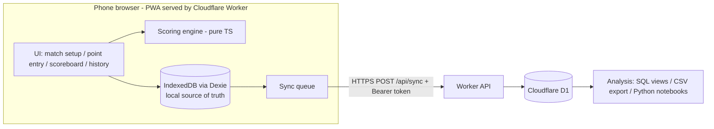

# Sheen Tennis Tracker - Workflow Log

> Read this file at the start of every session to resume from the latest checkpoint.
> Update it after each meaningful step (ideas, decisions, completed work, next actions).

## Project Overview

- **Name:** sheen_tennis_tracker
- **Goal:** Mobile web app (PWA, no native iOS/Android) to record live tennis matches point by point, with point details (serve 1st/2nd, rally, outcome, etc.), automatic scoring under configurable match rules, and cloud storage for later analysis.
- **Hosting (dev):** Cloudflare Worker with static assets (https://sheen-tennis-tracker.sheenzhaox.workers.dev), auto-built from GitHub.
- **Tech stack:** Vite 8 + React 19 + TypeScript, vite-plugin-pwa, Dexie (IndexedDB), backend: Cloudflare Worker API (`worker/index.ts`) + D1, auth: bearer sync token (Worker secret `API_TOKEN`), Vitest, Wrangler 4.
- **Scope (current stage):** singles only, single user (me), no spectator live view. Multi-user may come later.

## Current Checkpoint

- **Deployed release (2026-10-08, evening):** production on `dev/build-match-tracker` at `53cbe48` includes named finalisation reasons, player quick-add ownership and cached-ownership repair, Note below Undo, Down line, and Drive volley with separate legacy/Not set stats. All 73 tests, frontend/Worker type checks, production build, and Worker packaging pass. No new database migration was required. Cloudflare Git deployment verified at 11:19:47 UTC (Worker version `b12a74a5-105b-439b-bbed-2b36f3d772e6`), including live feature/Note-order checks and anonymous access to a currently active stats link. The previously supplied coach token is no longer in the link table; it was not restored or modified. Refresh the updated app as `elliez` and use Settings > Sync now to repair cached player ownership without clearing local data.
- **Rally shot options (2026-10-08, deployed):** rally direction "Down the line" is now "Down line" (return direction unchanged). Drive volley replaces Topspin in new rally entry. Private/public stats include Drive volley and explicit Not set shot counts; legacy Topspin records remain intact and appear as Topspin (legacy) only where the filtered data contains them. Point logs and CSV use the same labels. No existing records are relabelled as Drive volley.
  - Verified: 19 focused stats, entry-rendering, and CSV tests pass, including separate Drive volley/legacy/Not set counts, conditional legacy rows, and CSV labels. Production build and frontend/Worker type checks pass.
- **Point note placement (2026-10-08, deployed):** moved the Note button and expandable observation field below Undo in both serve and rally entry. Note state and saving behavior are unchanged.
- **Player ownership sync repair (2026-10-08, deployed):** production D1 confirms `Test1` belongs to normal user `elliez`; its admin-list exclusion is correct. New Match's inline player picker omitted local ownership, and client sync skipped authoritative ownership when timestamps matched, leaving those local players incorrectly shared/read-only. Both player creation paths now assign local ownership consistently. Sync merges server ownership independently of content timestamps while preserving newer local edits and dirty flags. The first successful sync after this update performs a full pull to repair older affected local copies; no server ownership is guessed or reassigned.
  - Verified: 15 focused client/server sync tests and production build pass. Browser reproduction started with a same-timestamp player missing local ownership, then confirmed sync restores editing/deletion, the repair survives reload, and the owner can delete it. Separate offline browser checks confirmed New Match quick-add immediately creates editable private players for normal users and shared players for admins. After deployment, refresh the app as `elliez` and use Settings > Sync now; do not clear browser data.
- **Named finalisation reasons (2026-10-08, deployed):** retirement reason buttons now use the match's actual player names rather than "Player 1" and "Player 2". Reason options and finalised summaries share the same formatter; stored reason values remain unchanged.
- **Deployed release (2026-10-08):** production on `dev/build-match-tracker` at `1a44d16` includes player ownership, match deletion/finalisation, side-by-side match actions, point observations, and persistent public stats links. Migrations `0005_player_owner.sql` and `0006_stats_link_token.sql` applied successfully to both production and preview D1 before pushing. All 61 tests, frontend/Worker type checks, production build, and `wrangler deploy --dry-run` pass. Cloudflare Git deployment verified at 09:58:31 UTC (Worker version `3cdca575-882a-494b-aa90-b992473d2a06`); production serves the new features and the existing coach link still returns stats anonymously. Cloudflare and local asset filenames differ, so verification used deployment metadata and live feature/API checks rather than filename equality. Next: coach sharing and phone install/offline field tests.
- **Persistent public stats links (2026-10-08, deployed):** confirmed the supplied production shared-stats URL and public API work without login in a fresh browser; the reported login prompt was not reproduced. Link management now retrieves the existing URL after returning to Stats or using another device. Migration `0006_stats_link_token.sql` retains capability tokens alongside hashes; token retrieval/restoration remains owner/admin-only. Existing hash-only links remain valid and can be restored by pasting their original URL, without rotation/revocation. Migration applied to both remote databases.
  - User confirmed refreshing resolved the login prompt. Verified: 13 backend tests, production build, all six migrations on isolated local D1, and 15 Worker/D1 lifecycle checks (anonymous access, owner/admin retrieval, new-session persistence, permissions, restoration, rotation, revocation). Mobile browser checks verified the same URL and Copy button after navigation/reload, plus restoration of a real hash-only row without changing its URL.
- **Point observations (2026-10-08):** removed Finalise match from the score recording screen (finalise from Matches only). Note opens a multiline field for the current point, retained between first/second serve and rally entry, saved with recorded/manual points, and reset after saving. Notes appear in the private point log and CSV export; public stats links omit observations. Draft notes remain in memory until the point is saved.
  - Verified: production build and 15 focused CSV/public-stats tests pass. Isolated mobile browser checks confirmed first-fault/rally transitions retain the note, rally and ace points save their own notes, saved notes survive reload, the next point starts empty, and Finalise is absent from recording.
- **Match action layout (2026-10-08):** Matches page now places compact Finalise and Delete buttons side by side on the right of each match, with 44px minimum touch-target height and space between them. The expanded finalisation form still uses the full row.
- **Player ownership (2026-10-08, step 36, deployed):** admin-added players are shared with everyone, user-added players are private to that user, and users can edit or delete only their own players. Rating/Club/Notes stay as optional fields. Verified with the build, 40 tests, a local Worker/D1 end-to-end check, and a browser check. Migration `0005_player_owner.sql` applied to both remote databases.
- **Resume verified (2026-10-08):** started from a clean working tree on `dev/build-match-tracker` at `03939a2` (`origin/dev/build-match-tracker`). `npm test` passes all 35 tests and `npm run build` succeeds, including frontend/Worker type checks and PWA asset generation. Production deployment for this commit was not checked in this session. Next: field-test public stats links with coaches, account sharing, CSV download on phones, and phone install/offline behavior.
- **Previous deployment (2026-10-07):** Production on `dev/build-match-tracker` at `0c1bd8f` -> https://sheen-tennis-tracker.sheenzhaox.workers.dev. Match tracking, scoring, cloud sync, multi-user accounts, stats with set filters, phone setup Help, and point-log CSV export are deployed. `main` is behind and not deployed.
- **Current release (2026-10-07):** public stats sharing (step 35), verified with the production build, 35 tests, and local Worker/D1/browser checks. Migration `0004_public_stats.sql` applied to both remote DBs before pushing. Deployment uses the production branch `dev/build-match-tracker`; check its latest Cloudflare build for the release commit. Next: field-test public stats links with coaches, account sharing, and phone install/offline behavior.
- **Resume verified (2026-10-07):** clean checkout on `dev/build-match-tracker` at `77cfe3c`; `git pull --ff-only` already up to date. All 22 tests pass and `npm run build` succeeds (frontend + Worker type checks and PWA assets). Next remains device login, account creation, and sharing field tests; phone install/offline testing is still pending.
- **Phone setup guide (2026-10-07):** added `PHONE_SETUP.md` with iPhone/Safari and Android/Chrome home-screen installation, account login, pre-match sync/offline checks, and unsynced-data precautions. Device field testing remains pending.
- **In-app Help (2026-10-07):** added public `#/help`, linked from login and home, rendering `PHONE_SETUP.md` directly with `react-markdown` + `remark-gfm`. Help is lazy-loaded and precached with the PWA. Build and all 22 tests pass; browser checks confirm signed-out navigation, all guide sections/table rows, and no horizontal overflow at 320/390/1280px. Runtime dependency audit reports no vulnerabilities. Local preview: http://127.0.0.1:5173/#/help.
- **Point-log CSV export (2026-10-07):** expanded Match details now ends its point-by-point log with an Export CSV button (disabled when empty, available for view-only matches). CSV includes match ID, player names, point number, score before the point (A-B), winner, ending, server, both serve descriptions, and rally details. Shared formatting keeps the display/export consistent; `csv-stringify` handles quoting, UTF-8 BOM, and spreadsheet-formula protection. Build and 5 focused tests pass. Isolated browser checks verified visibility, mobile layout, CSV contents, and download filename/request; the integrated browser did not expose a download-completion event, so saved-file behavior on phones remains to be field-tested.
- **Public stats sharing (2026-10-07):** owners/admins can create, copy, replace, and revoke a link from Stats. Public `#/shared-stats/<random-token>` requires no login and reveals no real match ID. Only SHA-256 token hashes are stored in D1. Public views retain all stats filters but expose no private match notes, venue, owner data, IDs, or edit/share controls. Build and all 35 tests pass; real local Worker/D1 checks cover permissions, rotation, revocation, and deleted matches. Browser checks cover anonymous access, filters, create/copy/revoke, and 320/390/1280px layouts. Preview uses an isolated local DB at http://127.0.0.1:8788. Migration `0004` applied to production and preview via `npm run db:migrate:remote`; release uses commit + push to the production branch.
- **Commands:** `npm run dev` (Vite, proxies `/api` to 8787), `npm run dev:api` (Worker + local D1; needs `npm run build` once and `.dev.vars` with `API_TOKEN=dev-token`), `npm run build`, `npm test`, `npm run db:migrate:local`, `npm run db:migrate:remote`, `npm run icons`.

### How to resume (new session)
1. Open the folder in VS Code; `git checkout dev/build-match-tracker` and `git pull`.
2. Ask Copilot: "Read workflow.md and resume from the latest checkpoint."
3. In each new terminal: `$env:NODE_OPTIONS='--use-system-ca'` (company TLS inspection) before `npx wrangler ...`. Check login with `npx wrangler whoami`.
4. Local dev: `npm install` (if needed) -> `npm run build` -> `npm run dev:api` (terminal 1) -> `npm run dev` (terminal 2) -> http://localhost:5173 (log in as `admin`; first local login password = `dev-token`).
5. Deploy = commit + push to `dev/build-match-tracker`. If a change adds a table/column: create `migrations/000N_*.sql` and run `npm run db:migrate:remote` **before** pushing.
6. Sync token is only in your password manager (Cloudflare can't show it). To rotate: `npx wrangler secret put API_TOKEN` + `npx wrangler preview base-config secret put API_TOKEN`, then re-enter in Settings on each device.

### Cloud sync setup checklist
- [x] Cloudflare agent setup: 16 Cloudflare skills installed globally (`~/.agents/skills`), MCP servers in `.vscode/mcp.json` (cloudflare, docs, bindings, builds, observability; OAuth on first use)
- [x] `npx wrangler login` (account sheenzhaox@gmail.com, ID 1f19e6fef6c5c573de9b297ed4c18aa1; d1 write scope OK)
- [x] D1 created (free plan, region OC): `sheen-tennis-tracker` (6e70b0d1-1e78-440f-b354-2d2316e2fcc4, prod) and `sheen-tennis-tracker-preview` (a8b2a5f4-96db-4bee-a04b-839ac21af1be). Isolation via official Workers Previews `previews` block in `wrangler.jsonc` (same `DB` binding name); preview migrations via `wrangler.preview-migrations.jsonc`
- [x] `npm run db:migrate:remote` (both DBs migrated); `wrangler deploy --dry-run` OK
- [x] Token set: `API_TOKEN` production secret + Previews base-config secret (verified by name). User ran `npx wrangler deploy` locally -> **production already runs the sync code** (prod API returns 401 without token). Merge branch to `main` soon, otherwise a push to `main` would redeploy the old assets-only version.
- [x] Cloudflare build settings: build `npm run build`, deploy `npx wrangler deploy`
- [x] Commit + push branch (de44ebd); sync verified by user across devices on production
- [x] Merge `dev/build-match-tracker` into `main` (fast-forward) and push
- [x] Cloudflare dashboard: production branch switched back to `main` (`main` = production + prod DB; other branches = previews + preview DB)
- [x] DECIDED (2026-10-01): work only on `dev/build-match-tracker`; Cloudflare production branch = `dev/build-match-tracker` (deploys live site + prod DB). Non-production branch builds stay off; `main` is not deployed. `dev/match-setup` merged into it.
- Note: laptop network intercepts TLS (`SELF_SIGNED_CERT_IN_CHAIN`). **Fix (verified):** `$env:NODE_OPTIONS='--use-system-ca'` before wrangler commands (Node trusts the Windows cert store). Persist with `[Environment]::SetEnvironmentVariable('NODE_OPTIONS','--use-system-ca','User')`.

## Future Implementation

Ideas kept for later (not started):
1. **Break / set / match point indicators** on the tracker (e.g. "BP" tag in the status bar).
2. **Persist the in-progress point draft** across reloads (currently a reload after a 1st-serve fault restarts the point).
3. **Player-level stats across matches** (aggregate the per-match stats per player).
4. **Stats export** (CSV / JSON per match) for external analysis.
5. **Import CSV to match history** (import recorded matches from CSV files).
- Housekeeping: optionally bring `main` up to date with `dev/build-match-tracker`.

## Feasibility Analysis (2026-10-01)

| Question | Verdict | Notes |
|---|---|---|
| Phone web app instead of native | Feasible | Build as a PWA: installable to home screen, full-screen, works offline (service worker). Screen Wake Lock API keeps screen on during a match (iOS 16.4+, Android Chrome). |
| Host on GitHub Pages | Feasible for frontend only | Pages serves static files only: no server code, no database. Free for public repos (private repo Pages needs a paid plan). Deploy via GitHub Actions. |
| Backend / database | Feasible via external BaaS | Use Supabase (free tier: Postgres, Auth, Realtime, REST). Frontend calls it directly; security via Row Level Security (RLS). Anon key is safe to ship; never ship the service-role key. Alternative: Firebase Firestore. |
| Real time | Feasible | Point entry is local and instant (no network needed). Courtside connectivity is unreliable, so the app is **offline-first**: save every point to IndexedDB, sync to Supabase in background. Optional live score for spectators via Supabase Realtime. |
| Auto scoring w/ different rules | Feasible | Pure TypeScript scoring engine, rule-config driven, fully unit-testable. |

## Proposed Architecture



### Key design principles
1. **Event sourcing:** a match = rules config + ordered list of point events. Score is always derived by replaying events -> undo/edit is trivial, no score corruption, full data kept for analysis.
2. **Offline-first:** write locally first; sync with idempotent upserts (client-generated UUIDs).
3. **Fast entry UI:** large buttons, minimal taps per point, one-handed use; required fields minimal, details optional.

### Match rules config (scoring engine)
- Best of 1 / 3 / 5 sets; games per set (6, or 4 for Fast4/short sets)
- Advantage vs no-ad (deciding point)
- Tiebreak at 6-6 (or 3-3 / 4-4), tiebreak points (7)
- Final set: full set / tiebreak to 7 / match tiebreak to 10 (super tiebreak) / advantage set
- Singles / doubles (server rotation)
- Let rule (play let / no-let)

### Point data model (draft)
- `id`, `match_id`, `seq`, `timestamp`
- `server`, `serve` (1st / 2nd), `serve_side` (deuce / ad)
- `first_serve_result` / `second_serve_result` (in / fault: net, long, wide), `ace`, `double_fault`
- `rally_length` (shot count)
- `winner_player`, `end_type` (winner / unforced error / forced error / ace / double fault)
- `last_shot` (FH / BH / volley / overhead / drop / lob / return / serve), optional: `net_approach`, `location`
- `notes`
- Derived (not stored): game/set/match score, break points, tiebreak flags

### Backend tables (D1, draft)
- `players`, `matches` (players, rules JSON, date, venue, status), `points` (above fields)

### Proposed folder structure
```
src/
  engine/      scoring engine + rules (pure TS, unit tested)
  model/       types for Match, Point, Rules
  storage/     Dexie DB + sync to Supabase
  ui/          pages & components (setup, point entry, scoreboard, history, stats)
```
(No deploy workflow needed: Cloudflare builds on push.)

### Phased plan
1. **Phase 1:** Scaffold Vite + React + TS + PWA; connect repo to Cloudflare Pages (build `npm run build`, output `dist`).
2. **Phase 2:** Scoring engine + rules + unit tests (Vitest).
3. **Phase 3:** Match setup + point entry UI + scoreboard + undo; local storage (IndexedDB).
4. **Phase 4:** Cloudflare D1 schema, Worker API routes (`/api/*`) via `wrangler.jsonc` (`main` + `assets` + D1 binding), Cloudflare Access auth, background sync.
5. **Phase 5:** History, stats (1st serve %, points won on 1st/2nd serve, winners/UE, rally length dist.), CSV/JSON export.
6. **Phase 6 (optional, not needed now):** Live spectator view.

## Ideas & Decisions

| Date | Idea / Decision | Notes |
|------|-----------------|-------|
| 2026-10-01 | Use `workflow.md` as the persistent project log | Resume from "Current Checkpoint" after restarting VS Code |
| 2026-10-01 | PWA instead of native apps | Single codebase, installable, offline capable |
| 2026-10-01 | GitHub Pages for frontend; Supabase proposed for backend | Pages has no DB/server; pending confirmation |
| 2026-10-01 | Offline-first + event-sourced points | Unreliable courtside network; easy undo; rich analysis data |
| 2026-10-01 | Offline requirements: precache app shell, `navigator.storage.persist()`, show unsynced-points indicator, install to home screen (iOS storage eviction) | First load/login/updates still need network |
| 2026-10-01 | If Cloudflare: keep GitHub repo as source; connect via Cloudflare Git integration (auto build on push, preview per branch). Build `npm run build`, output `dist`, Vite `base: '/'` | Supabase URL/anon key set as env vars in Cloudflare |
| 2026-10-01 | Hosting alternatives reviewed: Cloudflare Pages, Vercel, Netlify, Firebase Hosting, Render | Frontend is static, so host is swappable |
| 2026-10-01 | **Recommended:** Supabase (Postgres) for data; GitHub Pages if repo public, else Cloudflare Pages | SQL suits analysis better than Firestore; Vercel Hobby is non-commercial only |
| 2026-10-01 | **DECIDED: Cloudflare Pages for hosting** (replaces GitHub Pages) | Free for private repos, preview URL per branch, no deploy workflow needed |
| 2026-10-01 | Actually deployed as **Cloudflare Worker with static assets** (workers.dev), not Pages | Cloudflare's recommended path; fine. API in Phase 4 = Worker script instead of Pages Functions; D1/Access unchanged. No wrangler config in repo yet (dashboard defaults) |
| 2026-10-01 | Branch previews: non-production branch builds + preview URLs (branch alias, `/` -> `-`) | Previews share production bindings -> in Phase 4 use a separate preview D1 so previews can't write prod data |
| 2026-10-01 | DECIDED: React + TS; singles only; single user; no live view (for now) | Keep engine extensible for doubles; multi-user later |
| 2026-10-01 | Backend: **D1 recommended** over Supabase given current scope | Same platform/deploy; no inactivity pause (Supabase free pauses after ~7 days idle); SQL (SQLite) fine for analysis; auth via Cloudflare Access (free) on `/api/*`. Cost: write small API in Pages Functions. KV not needed. Supabase stays the fallback if multi-user/realtime needs grow |
| 2026-10-01 | Cross-device sync brought forward (option 2) after data didn't appear across devices | IndexedDB is per device + per origin |
| 2026-10-01 | **Auth changed: bearer sync token instead of Cloudflare Access** | Access login redirects/cookies are unreliable in installed iOS PWAs; token works offline-first and is simple for a single user. Revisit for multi-user |
| 2026-10-01 | Two D1 DBs: prod `DB` at top level; preview DB bound as `DB` inside `previews` block (replaces earlier host-routing idea with `PROD_HOST`/`DB_PREVIEW`) | Official Workers Previews isolation; simpler Worker code |
| 2026-10-01 | Stay on **Workers Free plan** | Since 2026-09-01 D1 free-tier overages make queries fail until midnight UTC (no charges). Usage here is tiny |
| 2026-10-01 | Sync protocol: soft deletes (`deletedAt`), `dirty` flag, last-write-wins on `updatedAt`, server `synced_at` cursor (60 s overlap) | D1 tables store key columns + JSON `data` |
| 2026-10-05 | **Multi-user: username/password accounts with server sessions** (replaces the shared sync token) | Matches owned per user, players shared, rules admin-managed, admin can view/delete everything and share matches view-only. Bearer session token in IndexedDB keeps the app offline-first |
| 2026-10-07 | **Public read-only stats links for coaches without accounts** | Independent random 256-bit tokens, stored as SHA-256 hashes. Owners/admins create or revoke links; replacing a link invalidates the previous one. Public stats show only player names and scoring details, not private match metadata. |
| 2026-10-08 | **Player ownership: admin-added players are shared, user-added players are private** | Users edit/delete only their own players (shared ones read-only); admin doesn't list users' players. Players in visible matches still sync for names. Rating/Club/Notes kept, labelled optional. Existing players remain shared. |

## Step Log

### 2026-10-01
1. Created `workflow.md` to track ideas, decisions, and progress.
2. Defined project goal; completed feasibility analysis (PWA, GitHub Pages, backend, real time); proposed architecture and phased plan.
3. Reviewed hosting alternatives and offline behavior; chose Cloudflare Pages.
4. Confirmed scope (React+TS, singles, single user, no live view); compared D1 vs Supabase -> D1 recommended.
5. D1 confirmed. Phase 1 scaffold: package.json, tsconfig, vite.config.ts (PWA manifest, Vitest), index.html, `public/logo.svg` + generated icons, `src/main.tsx`, `src/ui/App.tsx` placeholder, `src/index.css`, .gitignore. Build and test pass.
6. Cloudflare account: not needed until deploying (phone PWA testing needs HTTPS) and Phase 4 (D1, Access). Free, no card required.
7. Deployed as Cloudflare Worker static assets at https://sheen-tennis-tracker.sheenzhaox.workers.dev.
8. Phase 1.5 - main page & data management (Dexie brought forward from Phase 3):
   - Home: Start/Resume a match (shows in-progress count), Players, Rules.
   - Hash router (`src/ui/router.ts`): `#/`, `#/players[/new|/:id]`, `#/rules[/new?from=:id|/:id]`, `#/match[/new|/:id]`.
   - Dexie DB `sheen-tennis-tracker` v1 (`src/storage/db.ts`): `players`, `ruleSets` (custom only), `matches` (indexed by status, startedAt, playerAId, playerBId).
   - Players: add/edit/delete (delete blocked if player has matches); player page lists linked matches.
   - Rules: 7 built-in presets in code (`src/model/rules.ts`, read-only, can be duplicated) + custom rule sets in DB; `describeRules`, `validateRules` (+ tests).
   - Matches: new-match form (players, rules, first server, surface, indoor, venue; quick-add player returns to form). Match stores a **snapshot of rules**. Match page is a placeholder for Phase 3 point entry.
   - `navigator.storage.persist()` requested on startup.
9. Created branch `dev/build-match-tracker` (pushed).
10. Cloud sync (Phase 4 brought forward), on branch:
   - `wrangler.jsonc` (Worker `main`, assets `./dist` SPA, `/api/*` worker-first, D1 `DB`, var `ENVIRONMENT`; `previews` block binds `DB` to the preview database).
   - `migrations/0001_init.sql`: `players`, `rule_sets`, `matches` (id, updated_at, deleted_at, synced_at, data JSON).
   - `worker/index.ts`: `POST /api/sync` (push dirty + pull since cursor), `GET /api/ping`; bearer token check (SHA-256 + timingSafeEqual); input validation + size limits; prepared statements.
   - Client: Dexie v2 (`dirty` index, `meta` table), `saveRecord`/`deleteRecord` (soft delete), `src/storage/sync.ts` (debounced, on online/visible, every 60 s), Settings page (`#/settings`) for token + status, sync status on home.
   - SW `navigateFallbackDenylist` for `/api/`; Vite proxy `/api` -> 8787.
   - Verified locally: 401 on bad token, sync, restore on wiped DB, delete propagation.
11. Branch `dev/match-setup` - two-step match flow:
   - Step 1 setup (`#/match/new`, edit via `#/match/:id/edit`): date (default today), players A/B (select, or inline "+ New player..." creates one), surface (Hard / Clay / Synthetic grass / Grass), match info (event, round, venue/court, notes), match format (rule set + summary). "Next" saves match with status `scheduled`.
   - Step 2 start (`#/match/:id` while scheduled, `StartMatchPage`): summary, "Who serves first?", Start match -> sets `firstServer`, `status: in_progress`, `startedAt` timestamp. Then match page (point tracking placeholder).
   - Model: `MatchStatus` + `scheduled`; `Surface` = hard | clay | synthetic_grass | grass; Match adds `date`, `event`, `round`, `createdAt`; `firstServer`/`startedAt` optional; `indoor` removed. Match lists sorted in memory (startedAt ?? createdAt); Matches page has "Not started" section.
12. Serve page + scoring engine (`dev/build-match-tracker`):
   - Engine `src/engine/score.ts`: `computeScore(rules, firstServer, winners)` replays point winners -> sets/games/points, tiebreak + match tiebreak, no-ad, deciding-set variants, server (tiebreak 1-2-2 rotation; TB counts as a game), deuce/ad side, match winner. `pointLabels` (0/15/30/40/AD). 12 tests in `score.test.ts`.
   - Point model (`Point`): matchId, seq, server, winner, serves[] ({result, location, type}), end (ace | double_fault | return_winner | return_error | rally). Dexie v3 `points` table; synced (worker kind `points`, D1 migration `0002_points.sql`).
   - Serve page (`MatchTracker.tsx`, shown on match page when in progress/completed): row 1 outcome (Ace (Unreturnable) / Fault / Serve in / Return Ace / Unforced Error Return), row 2 location (Wide/Body/T), row 3 type (Flat/Slice/Kick). Location/type optional -> saved as `none`. Tapping a type completes the serve; otherwise "Next". 1st-serve fault -> 2nd serve; 2nd fault -> double fault (receiver wins). Ace / UE return -> server wins; Return Ace -> receiver wins. Serve in -> temporary "who won the point?" (rally page TBD). Undo steps back within a point, then deletes last point (reopens a completed match). Match auto-completes on match point.
   - Score table (`ScoreTable.tsx`) at bottom: completed sets (tiebreak loser points as superscript, match tiebreak as [10]), current set games, current points; serve dot.
   - Draft serves (e.g. after a 1st-serve fault) are kept in memory only; a reload mid-point restarts that point.
13. Serve page update: outcome order Ace / Fault / Return Ace / Unforced Error Return / Serve in (last, full width). Return Ace or UE Return reveal rows: Return (Forehand/Backhand return), Return direction (Crosscourt/Down the line/Inside out); UE Return adds Return error (Net/Long/Wide). All optional (`none`). Stored on the serve as `return: {stroke, direction, error?}`. Return rows are shown **after** Serve location / Serve type. Picking a value in the last visible row (Serve type, or Return direction / Return error for return outcomes) completes the serve; otherwise "Next".
14. Match details (collapsed `<details>` on match page): when expanded, shows "Point by point" log (`PointLog.tsx`): per point the score before it (completed sets · games · points, A-B order; TB/MTB marked), then who won (+ how the point ended, who served), then serve details (1st/2nd: outcome, location, type, return stroke/direction/error).
15. Rally page (`RallyEntry.tsx`, after "Serve in"; status bar shows "Rally"): long "+ Rally count" button (null/None if never pressed); Point ending (2x2, player names): server winner & forced error / returner winner & forced error / server unforced error / returner unforced error; Stroke (Forehand/Backhand); if unforced error -> Error type (Net/Long/Wide); if winner & forced error -> optional "Lucky ball" toggle; Shot direction (Cross court/Down the line/Inside out/Inside in/Middle/Short angle); Shot type (Topspin/Slice/Volley/Smash/Lob); Shot position (Baseline/Approach/Net). Only Point ending is required; picking Shot position completes the point, else "Save point". Winner: server for server winner / returner UE, else returner. Stored as `point.rally: RallyDetail` (`count, ending, stroke, error?|lucky?, direction, shotType, position`). Point log shows a rally line. `OptionRow` moved to `src/ui/components/OptionRow.tsx`.
16. Score table pinned to the bottom of the screen (`.score-dock`, position fixed, safe-area aware); page gets bottom padding so content isn't hidden behind it.
17. Cleanup: serve outcome "Unforced Error Return" renamed "Return error" (UI + log; stored value still `return_error`). Shot type adds "Dropshot" (`dropshot`). Rally point ending split into two rows: "Point ended by" (server name / returner name) and "Ending" (Winner & forced error / Unforced error); combined into the same stored `RallyEnding` values.
18. Sync indicator on the match page (2026-10-02): badge in the docked score bar (left of "Points played"), links to Settings. States: ✓ Synced (green) / N pending, Offline · N pending, Syncing... (amber) / Sync off, Sync token rejected, Sync error (red). Auto-sync itself was already per change (1.5 s debounce, on reconnect, on app focus, every 60 s).
19. Serve page: when Fault is selected, a "Fault type" row (Net/Long/Wide) appears after Serve type; optional, stored as `serve.fault`; it's the last row for faults (picking it completes the serve). Shown in the point log, e.g. "1st: Fault (Net, Wide)".
20. Serve outcome colours: Ace = blue outline + blue text on white; selected -> solid blue with white text. Fault = red outline + red text on white; selected -> solid red with white text.
21. Manual score adjustment: a round "+" button after each player's name in the score table adds one missed point for that player (replaced the earlier "Edit score" panel with +Point/+Game). Missed points are saved as normal points with `end: 'unrecorded'`, `serves: []`, no rally (all features None), correct server; match auto-completes if it reaches match point. Undo removes them one at a time. Point log labels them "Not recorded (manual score)".
22. Match stats page (`#/match/:id/stats`, "Stats" link in the match page header; `src/stats/matchStats.ts` pure functions + 5 tests, UI `StatsPage.tsx`):
   - Definitions: **Winners** = Ace (server) + Return Ace (receiver) + rally "winner & forced error" (player who ended it). **Unforced errors** = Double fault (server) + Return error (receiver) + rally unforced error. Unrecorded (manual) points count only in points won.
   - Summary per player: points won, winners (aces / return aces / rally winners), UE (DF / return errors / rally errors), 1st serve in %, 1st & 2nd serve points won %.
   - Serve location (Wide/Body/T/Not set) for a chosen server, 1st & 2nd serve: in / hit and won / in. Filters: side (All / Deuce / Ad) and situation (All / First point of a game / Game point / Break point; tiebreak points have no situation; no-ad 40-40 counts as both game and break point).
   - Rally forehand/backhand winners & UE per player, filter All / 1-3-5 (rallies of 1, 3 or 5 shots, ended on the server's shot) / 2-4-6 (2, 4 or 6 shots, ended on the returner's shot) / 7+ shots (either). Rallies without a count only in All.
   - Shot type counts (last shot of rally) per player, winners vs UE.
   - UE breakdown per player: stroke (Forehand / Backhand / Serve (DF) / not set), court position (Baseline / Approach / Net / not set), error type (Net / Long / Wide / not set; DF uses the 2nd serve's fault type, return errors use the return error).

### 2026-10-03
23. Rally page: "Point ended by" + "Ending" rows merged into one "Point ending" group of 4 buttons (single choice): row 1 `<server> winner` / `<returner> winner` (blue, like Ace), row 2 `<server> UE` / `<returner> UE` (red, like Fault). Stored `RallyEnding` values unchanged.
24. Serve page: "Fault type" row moved between Serve location and Serve type. Serve type is now the last row for faults too (picking it completes the serve).
25. Docked score bar made compact (smaller padding, 0.9rem table font, smaller "+" buttons, 0.7rem sync badge / points count); page bottom padding 10rem -> 7.5rem.
26. Short player names (`shortName` in `format.ts`: "Ellie Zhao" -> "E. ZHAO") in the match page header and the serve status bar. Status bar compacted to one row (0.85rem, nowrap, "Deuce"/"Ad", "TB"/"MTB").
27. Field test with the updated build: 2 sets recorded (match `c2d6171f-a8e8-4255-9e58-3c6b9aeb8cfe`), no issues reported.
28. Stats: rally length unified (`rallyLength`): ace / DF = 1, return ace / return error = 2, rally = recorded rally count (null if not counted). "Rally: forehand / backhand" replaced by "Forehand / backhand" (`strokeStats(ctxs, player, games)`): row 1 player switch, row 2 optional toggle Service games / Return games (neither = all games). Columns Total / Forehand / Backhand ("-" where n/a). Rows:
   - All games: Winners (ace + return ace + rally winner), Unforced errors (DF + return error + rally UE), Short rally winners / UE (1-6 shots), Long rally winners / UE (7+).
   - Service games: Aces, Double faults, Serve +1 (winner at shot 3), Serve advantage (winners at 1/3/5), Serve disadvantage (opponent winners at 2/4/6).
   - Return games: Return aces, Return errors, Return advantage (winners at 2/4/6).
   - Winners include forced errors; return points use the return stroke for FH/BH.
29. Stats: "Rally winners" section (`rallyWinnerStats(ctxs, stroke)`): switch Forehand / Backhand; tables for both players by shot direction (not set -> Middle) and shot type (not set -> Topspin). Rally winners incl. forced errors; rallies with stroke not set are excluded.
30. Stats: "Unforced errors" section now filterable (`errorTypeStats(ctxs, stroke, position)`): row 1 Forehand / Backhand toggle (none = all UE incl. DF and stroke not set), row 2 Baseline / Approach / Net toggle (none = all; position not set, DF and return errors count as Baseline). Shows error type (Net / Long / Wide / Not set) for both players. Replaced the old stroke / position / type tables (`errorBreakdown` removed).

### 2026-10-05
31. Stats: per-section set filter. Each section (Summary, Serve location, Forehand / backhand, Rally winners, Shot type, Unforced errors) has its own row of multi-select set buttons ("Set 1", "Set 2", ..., "MTB" for a match tiebreak); none selected = all sets played. `PointContext` gains `set` (0-based) and `matchTiebreak`; helpers `setOptions(ctxs)` and `filterSets(ctxs, sets)` (+ test). Committed and pushed (deployed).
32. **Milestone `v0.1.0`** (annotated tag): match setup, serve/rally entry, scoring engine, cloud sync, match stats with set filters. `dev/build-match-tracker` merged into `main` (fast-forward); `.vscode/mcp.json` committed, `*.tsbuildinfo` and `.vscode/settings.json` ignored.
33. **Multi-user accounts + login** (deployed 2026-10-05, `babb5b3`):
   - Decisions (asked user): admin creates accounts (no sign-up); no user-player link; admin shares a match with any user **view-only**; only admin manages custom rules; users can add + edit shared players but not delete; admin username `admin`.
   - D1 migration `0003_users.sql`: `users` (username unique NOCASE, role admin/user, PBKDF2 `password_hash`, `disabled_at`, `failed_logins`, `locked_until`), `sessions` (SHA-256 of token, 180-day expiry), `match_access` (match_id, user_id, revoked_at, synced_at); seeds user `admin` (id `admin`, no password); `matches.owner_id` (existing -> `admin`), `points.match_id` (backfilled from JSON).
   - Admin bootstrap: the first `admin` login uses the existing `API_TOKEN` secret as password (stored as the password hash on first login); then change it in Settings.
   - Worker split: `worker/http.ts` (Env, json, validators), `auth.ts` (PBKDF2 100k, login with 5-try / 15-min lockout, logout, change password -> signs out other devices), `admin.ts` (list/create/update users: reset password, role, disable; get/set match access), `sync.ts`, `index.ts` (routes). Endpoints: `POST /api/login`, `/api/logout`, `/api/password`, `GET /api/me`, `POST /api/sync`; admin: `GET/POST /api/users`, `PATCH /api/users/:id`, `GET/PUT /api/matches/:id/access`.
   - Sync permissions (server-enforced): non-admin can't delete anything, can't write rule sets, can only write own matches and their points; owner set by the server. Refused records come back in `rejected` with the server copy (client rolls back; none = remove locally). Pull is filtered: admin all; users own + shared matches/points. Revoked shares come back in `revoked` (client removes match + points). Granting access bumps `synced_at` of the match + points so they're re-sent. Pull adds `ownerId` / `ownerName` to matches.
   - Client: `src/storage/session.ts` (session in Dexie meta, `login`/`logout`/`api`); app is gated by `LoginPage`; switching account wipes local data (confirm if unsynced changes); devices from before accounts are treated as admin's. Logout wipes local data. 401 during sync drops the session but keeps data. `src/ui/user.ts` (`UserContext`, `useUser`, `isAdmin`, `canEditMatch`).
   - UI: Settings = account, sync now, change password, log out, "Manage users" (admin -> `#/users`, `UsersPage`). Matches list: own matches + "Shared with me" (view only, "by <owner>"); admin sees all with owner. Match page: shared -> read-only score + details + stats; admin -> "Shared with" user chips in Match details + Delete. Delete buttons (match, player) admin-only; rules: "+ New"/edit/duplicate admin-only.
   - Verified locally (wrangler dev + Playwright): login/lockout msg, admin create users, non-admin 403 on admin API, rejected delete/rule writes, share -> visible to user, revoke -> removed, view-only page, admin deletion.
   - **Deploy done:** `npm run db:migrate:remote` (both DBs), admin password hash set directly via `wrangler d1 execute` (prod `DB` + `PREVIEW_DB` with `--config wrangler.preview-migrations.jsonc`), then pushed. To reset a forgotten admin password: `UPDATE users SET password_hash = NULL, failed_logins = 0, locked_until = NULL WHERE username = 'admin'` -> next login accepts the `API_TOKEN` secret.

### 2026-10-07
34. Deployed phone setup guide, in-app Help, and point-log CSV export (`0c1bd8f`); added CSV import into match history to future tasks.
35. Public stats sharing:
   - Migration `0004_public_stats.sql`: `public_stats_links` keyed by match ID, with unique token hash and revocation timestamp.
   - Authenticated owner/admin endpoints: `GET/POST/DELETE /api/matches/:id/stats-link`; creating a new link replaces the existing token. Only the hash is saved; the raw link is shown when generated, so returning to the page offers replacement or revocation.
   - Unauthenticated `GET /api/public/stats/:token`: rejects invalid/revoked links and deleted matches, returns sanitized names/rules/points without internal identifiers or private metadata, uses `no-store` and no-index headers.
   - `StatsView` reused by private Stats and public `PublicStatsPage`; owner/admin `StatsShare` has Create/Copy/Revoke controls. Wide tables scroll within their container on narrow phones.
   - Verified: production build, 35 tests (including 8 link/security tests), isolated local migration and Worker/D1 lifecycle, browser anonymous access and filters, owner link controls, mobile/desktop layouts. Migration `0004` applied to both remote databases before release; no existing match data was changed by the migration.

### 2026-10-08
36. Player ownership (admin-added players read-only for users; Rating/Club/Notes kept as optional fields):
   - Migration `0005_player_owner.sql`: `players.owner_id` (NULL = added by an admin, shared with everyone; else private to the creating user). Existing players stay shared. Owner is server-assigned on insert (client value ignored).
   - Sync pull for non-admins: shared players + own players + players referenced by visible (own or granted) matches, so shared-match names still resolve. Admin pulls all players (needed for names in users' matches) but only lists shared ones. Match upserts and admin match-access grants bump the match's players' `synced_at` so newly visible names are delivered.
   - Sync push (`canWritePlayer`): users may add players, and edit/delete only their own; deleting a player used in a live match is rejected. Admins unchanged. Rejected writes roll back via the existing `rejected` mechanism.
   - Client: `Player.ownerId` (set locally for new user players so they list before sync); `usePlayers` = listed players (`isListedPlayer`: shared or own), `useAllPlayers`/`usePlayerNames` include everything for match names. Player page: only Name is required (Rating/Club/Notes labelled optional); shared players are view-only for users ("Shared player added by an admin"); other users' private players show "Player not found"; Delete available to whoever can edit. Match setup keeps an existing match's players selectable. On match-access revocation, other users' private players no longer used by local matches are purged.
   - Verified: build, 40 tests (5 new `worker/sync.test.ts`), isolated local Worker/D1 end-to-end script (14 checks: visibility, spoofed owner, edit/delete permissions, in-use delete, grant/revoke delivery), browser check as a normal user (list, add, read-only shared player, delete synced).
   - Deploy: run `npm run db:migrate:remote` (applies `0005`) **before** pushing.

## Open Questions / TODO

- [x] Define project goal and core features
- [x] Confirm frontend framework: React + TS
- [x] Confirm backend: D1 (Cloudflare)
- [x] Singles only (current stage)
- [x] Live spectator view: not needed now
- [x] Single user now; multi-user maybe later
- [x] Hosting: Cloudflare Pages (repo can be public or private)
- [x] Scaffold project structure (Phase 1, local)
- [x] Create Cloudflare account + connect repo (deployed to workers.dev)
- [ ] Test install + offline on phone
- [x] Main page + Players + Rules + Start/Resume match (local)
- [ ] Phase 2: scoring engine + tests
