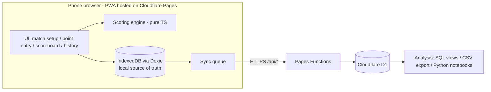

# Sheen Tennis Tracker - Workflow Log

> Read this file at the start of every session to resume from the latest checkpoint.
> Update it after each meaningful step (ideas, decisions, completed work, next actions).

## Project Overview

- **Name:** sheen_tennis_tracker
- **Goal:** Mobile web app (PWA, no native iOS/Android) to record live tennis matches point by point, with point details (serve 1st/2nd, rally, outcome, etc.), automatic scoring under configurable match rules, and cloud storage for later analysis.
- **Hosting (dev):** Cloudflare Pages (DECIDED), connected to this GitHub repo via Git integration.
- **Tech stack:** Vite 8 + React 19 + TypeScript (DECIDED), vite-plugin-pwa, Dexie (IndexedDB, Phase 3), backend: Cloudflare D1 + Pages Functions + Cloudflare Access (DECIDED), Vitest.
- **Scope (current stage):** singles only, single user (me), no spectator live view. Multi-user may come later.

## Current Checkpoint

- **Status:** Phase 1.5 committed and pushed to `main` (commit 10bd162). Working on branch `dev/build-match-tracker` for Phase 2.
- **Next step:** Phase 2: scoring engine (uses `Rules` from `src/model/types.ts`) + tests.
- **Commands:** `npm run dev` (local), `npm run build`, `npm test`, `npm run icons` (regenerate icons from `public/logo.svg`).

## Feasibility Analysis (2026-10-01)

| Question | Verdict | Notes |
|---|---|---|
| Phone web app instead of native | Feasible | Build as a PWA: installable to home screen, full-screen, works offline (service worker). Screen Wake Lock API keeps screen on during a match (iOS 16.4+, Android Chrome). |
| Host on GitHub Pages | Feasible for frontend only | Pages serves static files only: no server code, no database. Free for public repos (private repo Pages needs a paid plan). Deploy via GitHub Actions. |
| Backend / database | Feasible via external BaaS | Use Supabase (free tier: Postgres, Auth, Realtime, REST). Frontend calls it directly; security via Row Level Security (RLS). Anon key is safe to ship; never ship the service-role key. Alternative: Firebase Firestore. |
| Real time | Feasible | Point entry is local and instant (no network needed). Courtside connectivity is unreliable, so the app is **offline-first**: save every point to IndexedDB, sync to Supabase in background. Optional live score for spectators via Supabase Realtime. |
| Auto scoring w/ different rules | Feasible | Pure TypeScript scoring engine, rule-config driven, fully unit-testable. |

## Proposed Architecture



### Key design principles
1. **Event sourcing:** a match = rules config + ordered list of point events. Score is always derived by replaying events -> undo/edit is trivial, no score corruption, full data kept for analysis.
2. **Offline-first:** write locally first; sync with idempotent upserts (client-generated UUIDs).
3. **Fast entry UI:** large buttons, minimal taps per point, one-handed use; required fields minimal, details optional.

### Match rules config (scoring engine)
- Best of 1 / 3 / 5 sets; games per set (6, or 4 for Fast4/short sets)
- Advantage vs no-ad (deciding point)
- Tiebreak at 6-6 (or 3-3 / 4-4), tiebreak points (7)
- Final set: full set / tiebreak to 7 / match tiebreak to 10 (super tiebreak) / advantage set
- Singles / doubles (server rotation)
- Let rule (play let / no-let)

### Point data model (draft)
- `id`, `match_id`, `seq`, `timestamp`
- `server`, `serve` (1st / 2nd), `serve_side` (deuce / ad)
- `first_serve_result` / `second_serve_result` (in / fault: net, long, wide), `ace`, `double_fault`
- `rally_length` (shot count)
- `winner_player`, `end_type` (winner / unforced error / forced error / ace / double fault)
- `last_shot` (FH / BH / volley / overhead / drop / lob / return / serve), optional: `net_approach`, `location`
- `notes`
- Derived (not stored): game/set/match score, break points, tiebreak flags

### Backend tables (D1, draft)
- `players`, `matches` (players, rules JSON, date, venue, status), `points` (above fields)

### Proposed folder structure
```
src/
  engine/      scoring engine + rules (pure TS, unit tested)
  model/       types for Match, Point, Rules
  storage/     Dexie DB + sync to Supabase
  ui/          pages & components (setup, point entry, scoreboard, history, stats)
```
(No deploy workflow needed: Cloudflare builds on push.)

### Phased plan
1. **Phase 1:** Scaffold Vite + React + TS + PWA; connect repo to Cloudflare Pages (build `npm run build`, output `dist`).
2. **Phase 2:** Scoring engine + rules + unit tests (Vitest).
3. **Phase 3:** Match setup + point entry UI + scoreboard + undo; local storage (IndexedDB).
4. **Phase 4:** Cloudflare D1 schema, Worker API routes (`/api/*`) via `wrangler.jsonc` (`main` + `assets` + D1 binding), Cloudflare Access auth, background sync.
5. **Phase 5:** History, stats (1st serve %, points won on 1st/2nd serve, winners/UE, rally length dist.), CSV/JSON export.
6. **Phase 6 (optional, not needed now):** Live spectator view.

## Ideas & Decisions

| Date | Idea / Decision | Notes |
|------|-----------------|-------|
| 2026-10-01 | Use `workflow.md` as the persistent project log | Resume from "Current Checkpoint" after restarting VS Code |
| 2026-10-01 | PWA instead of native apps | Single codebase, installable, offline capable |
| 2026-10-01 | GitHub Pages for frontend; Supabase proposed for backend | Pages has no DB/server; pending confirmation |
| 2026-10-01 | Offline-first + event-sourced points | Unreliable courtside network; easy undo; rich analysis data |
| 2026-10-01 | Offline requirements: precache app shell, `navigator.storage.persist()`, show unsynced-points indicator, install to home screen (iOS storage eviction) | First load/login/updates still need network |
| 2026-10-01 | If Cloudflare: keep GitHub repo as source; connect via Cloudflare Git integration (auto build on push, preview per branch). Build `npm run build`, output `dist`, Vite `base: '/'` | Supabase URL/anon key set as env vars in Cloudflare |
| 2026-10-01 | Hosting alternatives reviewed: Cloudflare Pages, Vercel, Netlify, Firebase Hosting, Render | Frontend is static, so host is swappable |
| 2026-10-01 | **Recommended:** Supabase (Postgres) for data; GitHub Pages if repo public, else Cloudflare Pages | SQL suits analysis better than Firestore; Vercel Hobby is non-commercial only |
| 2026-10-01 | **DECIDED: Cloudflare Pages for hosting** (replaces GitHub Pages) | Free for private repos, preview URL per branch, no deploy workflow needed |
| 2026-10-01 | Actually deployed as **Cloudflare Worker with static assets** (workers.dev), not Pages | Cloudflare's recommended path; fine. API in Phase 4 = Worker script instead of Pages Functions; D1/Access unchanged. No wrangler config in repo yet (dashboard defaults) |
| 2026-10-01 | Branch previews: non-production branch builds + preview URLs (branch alias, `/` -> `-`) | Previews share production bindings -> in Phase 4 use a separate preview D1 so previews can't write prod data |
| 2026-10-01 | DECIDED: React + TS; singles only; single user; no live view (for now) | Keep engine extensible for doubles; multi-user later |
| 2026-10-01 | Backend: **D1 recommended** over Supabase given current scope | Same platform/deploy; no inactivity pause (Supabase free pauses after ~7 days idle); SQL (SQLite) fine for analysis; auth via Cloudflare Access (free) on `/api/*`. Cost: write small API in Pages Functions. KV not needed. Supabase stays the fallback if multi-user/realtime needs grow |

## Step Log

### 2026-10-01
1. Created `workflow.md` to track ideas, decisions, and progress.
2. Defined project goal; completed feasibility analysis (PWA, GitHub Pages, backend, real time); proposed architecture and phased plan.
3. Reviewed hosting alternatives and offline behavior; chose Cloudflare Pages.
4. Confirmed scope (React+TS, singles, single user, no live view); compared D1 vs Supabase -> D1 recommended.
5. D1 confirmed. Phase 1 scaffold: package.json, tsconfig, vite.config.ts (PWA manifest, Vitest), index.html, `public/logo.svg` + generated icons, `src/main.tsx`, `src/ui/App.tsx` placeholder, `src/index.css`, .gitignore. Build and test pass.
6. Cloudflare account: not needed until deploying (phone PWA testing needs HTTPS) and Phase 4 (D1, Access). Free, no card required.
7. Deployed as Cloudflare Worker static assets at https://sheen-tennis-tracker.sheenzhaox.workers.dev.
8. Phase 1.5 - main page & data management (Dexie brought forward from Phase 3):
   - Home: Start/Resume a match (shows in-progress count), Players, Rules.
   - Hash router (`src/ui/router.ts`): `#/`, `#/players[/new|/:id]`, `#/rules[/new?from=:id|/:id]`, `#/match[/new|/:id]`.
   - Dexie DB `sheen-tennis-tracker` v1 (`src/storage/db.ts`): `players`, `ruleSets` (custom only), `matches` (indexed by status, startedAt, playerAId, playerBId).
   - Players: add/edit/delete (delete blocked if player has matches); player page lists linked matches.
   - Rules: 7 built-in presets in code (`src/model/rules.ts`, read-only, can be duplicated) + custom rule sets in DB; `describeRules`, `validateRules` (+ tests).
   - Matches: new-match form (players, rules, first server, surface, indoor, venue; quick-add player returns to form). Match stores a **snapshot of rules**. Match page is a placeholder for Phase 3 point entry.
   - `navigator.storage.persist()` requested on startup.

## Open Questions / TODO

- [x] Define project goal and core features
- [x] Confirm frontend framework: React + TS
- [x] Confirm backend: D1 (Cloudflare)
- [x] Singles only (current stage)
- [x] Live spectator view: not needed now
- [x] Single user now; multi-user maybe later
- [x] Hosting: Cloudflare Pages (repo can be public or private)
- [x] Scaffold project structure (Phase 1, local)
- [x] Create Cloudflare account + connect repo (deployed to workers.dev)
- [ ] Test install + offline on phone
- [x] Main page + Players + Rules + Start/Resume match (local)
- [ ] Phase 2: scoring engine + tests
